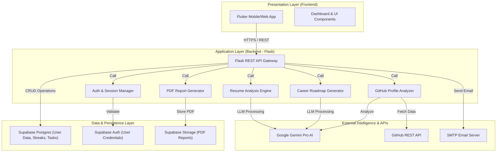

# System Architecture - Career Navigator

This document outlines the high-level system architecture of the Career Navigator application.

## 🏗️ Architecture Diagram (Mermaid)

You can copy the code below and paste it into [draw.io](https://app.diagrams.net/) via **Insert > Advanced > Mermaid**.

## 🧩 Component Breakdown

### 1. Presentation Layer (Flutter)
- **Framework**: Flutter (Multi-platform)
- **Responsibility**: User interaction, data visualization (charts, streaks), and local state management.
- **Key Modules**: Dashboard, Resume Analysis UI, AI Roadmap, Interview Prep Screen.

### 2. Application Layer (Flask Backend)
- **Framework**: Flask (Python)
- **Responsibility**: API Gateway, business logic, AI orchestration, and PDF generation.
- **Key Modules**:
    - `app.py`: REST endpoints.
    - `ai_service.py`: Gemini API integration.
    - `pdf_generator.py`: Generating reports with `fpdf2`.
    - `parser.py`: PDF text extraction for resumes.

### 3. External Services
- **Google Gemini Pro**: The "brain" of the app, providing resume insights and roadmap generation.
- **GitHub API**: Used for portfolio analysis and fetching developer activity.
- **SMTP**: Handles automated email notifications for contact forms.

### 4. Data Layer (Supabase)
- **Database**: PostgreSQL for storing structured user data, streaks, and badges.
- **Authentication**: Managed via Supabase Auth (JWT based).
- **Object Storage**: Buckets for persistent storage of generated PDF reports.

---
*Generated by Antigravity AI*
